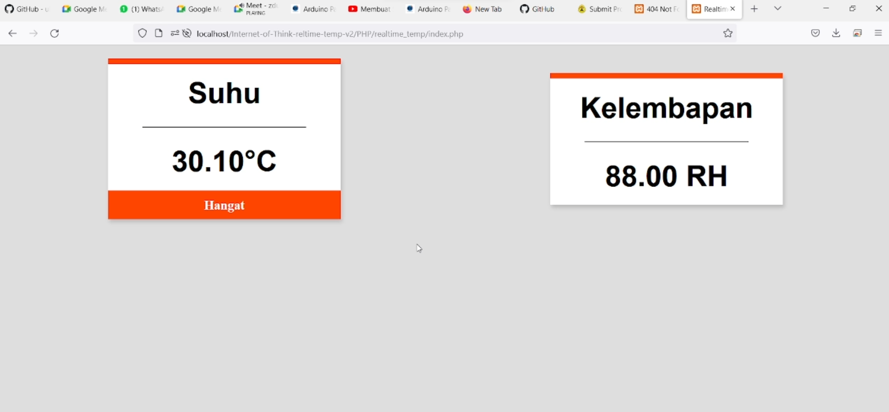

# [Internet-of-Think](https://github.com/deva121/Internet-of-Think-reltime-temp-v2.git)
## Realtime Temperature Monitor v2

### Creator: 
* Devara Nafiska Widi Widadi (g.111.19.0089)

### Description: 
[Video Presentasi](https://youtu.be/sUlmszJ8Hto) - Youtube   
Temperatur Suhu Update setiap detik  
jika suhu < 29 = semua lampu mati  
jika suhu >= 29 = 1 lampu hidup  
jika suhu >= 30 = 2 lampu hidup dan menyalakan alarm web  
jika suhu >= 31 = 3 lampu hidup dan menyalakan alarm web  
jika suhu > 32 = 3 lampu hidup dan menyalakan alarm web Berbahaya

### Screenshot:

